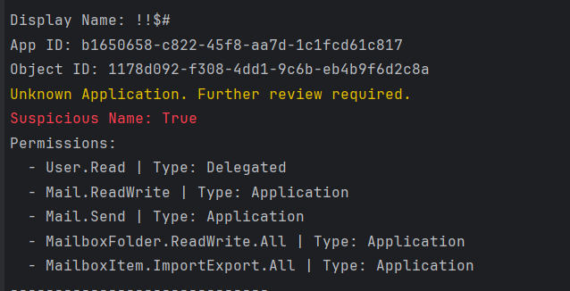
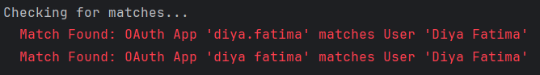
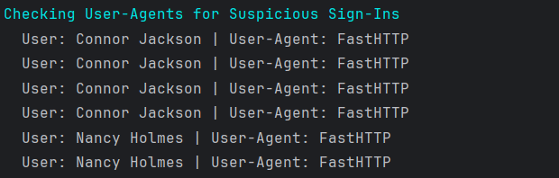
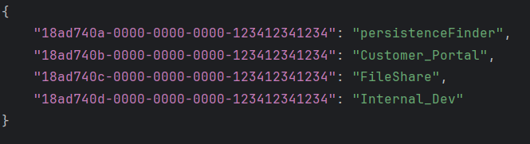

  <a href=""></a>
  <a href=""></a>

  <a href=""></a>

# CloudSweep
A highly configurable PowerShell application to provide an automated, repeatable and extendable framework to detect attack activity in EntraID.

   

CloudSweep is sponsored by CyberMaxx.

## Who is this for?
CloudSweep is designed for IR teams during an active intrusion to rapidly collect data needed for an investigation as well as to run after an investigation has concluded to ensure the threat actor does not remain in their network. This can also be used on a regular basis as an early indicator of compromise or as part of existing threat hunting activities.

## What does CloudSweep look for?
- OAuth2 Applications with known malicious Application IDs
- OAuth2 Applications with suspicious naming conventions (non-alphanumeric names or contain the word "test", etc.).
- OAuth2 Applications that match existing usernames or service principal IDs, automatically normalizing for common permutations
- Suspicious user-agents used to authenticate

## Features
Quickly review OAuth applications within EntraID looking for potentially malicious indicators, while also printing out the assigned permissions in human-readable format:

   

Automatically correlate Users and Service Principal names against registered OAuth Applications within the tenant, automatically normalizing entries for common permutations:

   

Review signin logs looking for suspicious user-agents on successful sign-ins:

   

A configurable whitelist is provided to prevent known-good applications within your tenant to appear in further analysis resutls, reducing the need for repeat review:

   

## Setup Instructions
1. Create a new OAuth2 Application
2. Copy the Client Secret and App (client) ID.
3. Copy the Tenant ID.
4. Put the Client Secret, Client ID and Tenant ID into the ./config/config.json file.
5. Run the application from an administrative PowerShell window.
6. The first time you run the tool you will receive multiple "Unknown Application" via the OAuth2 analysis. Copy the application ID into the whitelist.json file to remove these entries from being analyzed in future for known-good applications.

## Usage
Each of the individual scripts can be run independently depending on your specific needs. To run all scripts together:
- Open an Administrative PowerShell Window 
- Run `powershell.exe CloudSweep.ps1`
- Profit 

## ToDo
- Suspicious reply url: https://www.proofpoint.com/us/blog/cloud-security/revisiting-mact-malicious-applications-credible-cloud-tenants

## Help
- Q. How do I get my tenant ID? 
- A. Search for "Tenant Properties", the Tenant ID is the fifth option on the front page.

## Notes 
You must assign the following **Application** permissions (not delegated):
- Application.Read.All
- AuditLog.Read.All
- AuthenticationContext.Read.All
- Directory.Read.All 
- Policy.Read.All
- User.Read.All
- UserAuthenticationMethod.Read.All

You then must grant Admin Consent.

## Reference Notes:
Analysis is based on the following research linked below:
- [ProofPoint MACT Campaigns](https://www.proofpoint.com/us/blog/cloud-security/revisiting-mact-malicious-applications-credible-cloud-tenants)
- [HuntressLabs Known Bad App IDs](https://huntresslabs.github.io/rogueapps/)
- [Microsoft OAuth Attack Flow](https://www.microsoft.com/en-us/security/blog/2023/12/12/threat-actors-misuse-oauth-applications-to-automate-financially-driven-attacks/)
- [WIZ OAuth Attack Writeup](https://www.wiz.io/blog/midnight-blizzard-microsoft-breach-analysis-and-best-practices)
- [PerfectData Software OAuth Attack WriteUp](https://cybercorner.tech/malicious-azure-application-perfectdata-software-and-office365-business-email-compromise/)

## Disclaimer
CloudSweep is only to be used within environments that you either own or have permission to test. This tool will assist with detecting potential threats, however use of this tool does not mean you have detected all potential threats. Regular auditing with a diverse set of tools is recommended. The author accepts no liability for actions taken by its users. 
